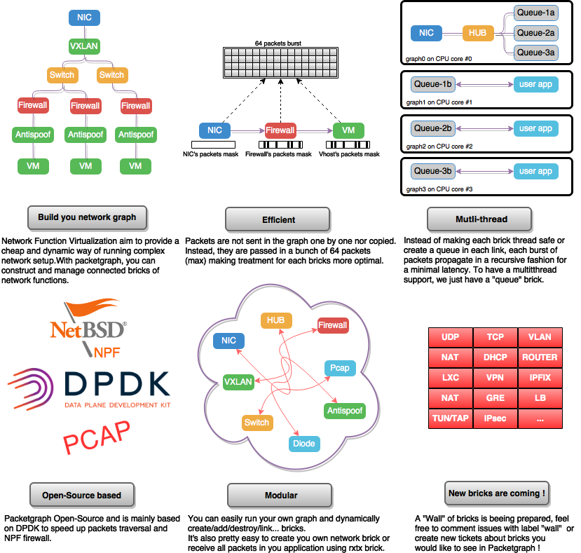

# Packetgraph ?

Packetgraph is a library aiming to give the user a tool to build networks graph easily, It's built upon the fast [DPDK library](http://dpdk.org/).

[](https://travis-ci.org/outscale/packetgraph) [](https://outscale.github.io/packetgraph/doc/master)

The goal of this library is to provide a really EASY interface to
build you own DPDK based application using [Network Function Virtualization](https://en.wikipedia.org/wiki/Network_function_virtualization)
Everyone is free to use this library to build up their own network application.

Once you have created and connected all bricks in you network graph,
some bricks will be able to poll a burst of packets (max 64 packets)
and let the burst propagate in you graph.

Connections between bricks don't store any packets and each burst will
propagate in the graph without any copy.

Each graph run on one core but you can connect different graph using
Queue bricks (which are thread safe). For example, a graph can be
split on demand to be run on different core or even merged.

If you want a graphical representation of a graph, you can generate a [dot](https://en.wikipedia.org/wiki/DOT_%28graph_description_language%29) output.



# Available bricks (ipv4/ipv6):

- switch: a layer 2 switch
- rxtx: setup your own callbacks to get and sent packets
- tap: classic kernel virtual interface
- vhost: allow to connect a vhost NIC to a virtual machine (virtio based)
- firewall: allow traffic filtering passing through it (based on [NPF](https://github.com/rmind/npf))
- diode: only let packets pass in one direction
- accumulator: batch bursted packets to increase poll and burst speed
- hub: act as a hub device, passing packets to all connected bricks
- nic: allow passing packets to a NIC of the system (accelerated by DPDK)
- print: a basic print brick to show packets flowing through it
- antispoof: a basic mac checking, arp anti-spoofing and ipv6 neighbor discovery anti-spoofing
- vtep: VXLAN Virtual Terminal End Point switching packets on virtual LANs, can encapsulate packets over ipv4 or ipv6
- queue: temporally store packets between graph
- pmtud(ipv4 only): Path MTU Discovery is an implementation of [RFC 1191](https://tools.ietf.org/html/rfc1191)
- user-dipole: setup your own callback in a dipole brick, to filter or implement your own protocol

A lot of other bricks can be created, check our [wall](https://github.com/outscale/packetgraph/issues?q=is%3Aopen+is%3Aissue+label%3Awall) ;)

# How should I use Packetgraph ?

Code Documentation: [doxygen link](https://outscale.github.io/packetgraph/doc/master)


# Examples

To build and run examples, you may first check how to build Packetgraph below and adjust your configure command before make:
```
$ ./configure --with-examples
$ make
```

To run a specific example, check run scripts in tests directories:
```
$ ./examples/switch/run_vhost.sh
$ ./examples/switch/run.sh
$ ./examples/firewall/run.sh
$ ./examples/rxtx/run.sh
$ ./examples/dperf/run.sh
...
```

# Building

You will need to build DPDK before building Packetgraph.

## Install needed tools

You may adapt this depending on your Linux distribution:

Ubuntu
```
$ sudo apt-get install libpcap-dev libglib2.0-dev libjemalloc-dev libnuma-dev openssl
```
CentOS
```
$ sudo yum install -y glibc-devel glib2-devel libpcap-devel git wget numactl numactl-devel openssl-devel clang
$ wget http://cbs.centos.org/kojifiles/packages/jemalloc/3.6.0/8.el7.centos/x86_64/jemalloc-devel-3.6.0-8.el7.centos.x86_64.rpm
$ wget http://cbs.centos.org/kojifiles/packages/jemalloc/3.6.0/8.el7.centos/x86_64/jemalloc-3.6.0-8.el7.centos.x86_64.rpm
$ sudo rpm -i jemalloc-devel-3.6.0-8.el7.centos.x86_64.rpm jemalloc-3.6.0-8.el7.centos.x86_64.rpm
```

## Build DPDK

```
$ git clone http://dpdk.org/git/dpdk
$ cd dpdk
$ git checkout -b v19.02 v19.02
$ make config T=x86_64-native-linuxapp-gcc
```

Note: use `T=x86_64-native-linuxapp-clang` to build with clang

Edit build/.config and be sure to set the following parameters to 'y':
- CONFIG_RTE_LIBRTE_PMD_PCAP

If you don't want to use some special PMD in DPDK requiring kernel headers,
you will have to set the following parameters to 'n':
- CONFIG_RTE_EAL_IGB_UIO
- CONFIG_RTE_KNI_KMOD

Once your .config file is ready, you can now build dpdk as follows:

```
$ make EXTRA_CFLAGS='-fPIC'
```

Finally, set `RTE_SDK` environment variable:
```
$ export RTE_SDK=$(pwd)
```

## Build packetgraph
```
$ git clone https://github.com/outscale/packetgraph.git
$ cd packetgraph
$ git submodule update --init
$ ./configure
$ make
$ make install
```

Note: to build with clang, you can use `./configure CC=clang`

Note 2: You need a compiler that support C11 (gcc 4.9 or superior, or clang 3.4 or superior).

## Configure Huge Pages

Packetgraph uses some [huge pages](https://en.wikipedia.org/wiki/Page_%28computer_memory%29#Huge_pages)
(adjust to your needs):

- Edit your `/etc/sysctl.conf` and add some huge pages:
```
vm.nr_hugepages=2000
```
- Reload your sysctl configuration:
```
$ sudo sysctl -p /etc/sysctl.conf
```
- Check that your huge pages are available:
```
$ cat /proc/meminfo | grep Huge
```
- Mount your huge pages:
```
$ sudo mkdir -p /mnt/huge
$ sudo mount -t hugetlbfs nodev /mnt/huge
```
- (optional) Add this mount in your `/etc/fstab`:
```
hugetlbfs       /mnt/huge  hugetlbfs       rw,mode=0777        0 0
```
# Compille Time Optimisation:

-DPG_BRICK_NO_ATOMIC_COUNT: do not use atomic variable to count packets, if you do so, you must call `pg_brick_pkts_count_get` in the same thread you use to poll packets
-DPG_VHOST_FASTER_YET_BROKEN_POLL: change the way vhost lock the queue so it spend less time locking/unlocking the queue, but can easily deadlock if badly use.

# Compille Time Option
-DTAP_IGNORE_ERROR: when packetgrapg can't burst or poll a tap, it return 0 instead of returning an error
-DPG_QEMU_MEM_SIZE=SIZE: allow to specify qemy ram size in test, parameter must be a string in qemu format, examples: -DPG_QEMU_MEM_SIZE="1G", -DPG_QEMU_MEM_SIZE="512M"

# Licence

Packetgraph project is published under [GNU GPLv3](http://www.gnu.org/licenses/quick-guide-gplv3.en.html).
For more information, check LICENSE file.

# Contribute

New to packetgraph ? Want to contribute and/or create a new brick ? Some
[developer guidelines](https://github.com/outscale/packetgraph/blob/master/doc/contrib.md/) are available.

# Question ? Contact us !

Packetgraph is an open-source project, feel free to [chat with us on IRC](https://webchat.freenode.net/?channels=betterfly&nick=packetgraph_user)

> server: irc.freenode.org

> chan: #betterfly

